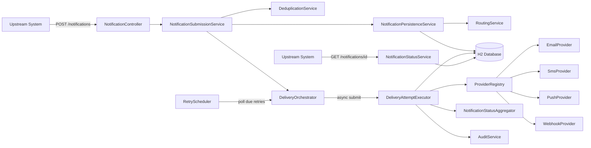

# Architecture Overview

## Components

## Layers

| Layer | Package | Responsibility |
|---|---|---|
| API | `api`, `api.dto` | HTTP contracts, bean validation, error mapping |
| Application services | `service` | Submission, status, routing, dedup, audit orchestration |
| Delivery pipeline | `service.delivery` | Async execution, retry policy, status rollup |
| Provider strategy | `service.provider` | Channel-specific send logic behind one interface |
| Persistence | `model`, `repository` | JPA entities and Spring Data repositories |
| Domain | `domain` | Enums encoding the state model and failure taxonomy |

## Control flow: submit -> deliver -> status

1. `NotificationController.submit` validates the request (Bean Validation)
   and calls `NotificationSubmissionService.submit`.
2. `DeduplicationService.checkAndReserve` enforces the idempotency boundary
   (requirement 4.4). If the key already exists, the original notification id
   is returned and a `NOTIFICATION_DUPLICATE_SUPPRESSED` audit event is
   recorded - no new notification is created.
3. `NotificationPersistenceService.persistNotification` saves the
   `NotificationEntity` (status `RECEIVED`), then `.routeAndQueue` calls
   `RoutingService.resolveChannels` per recipient (requirement 4.3) and
   creates one `RecipientChannelEntity` (status `QUEUED`) per resolved
   (recipient, channel) pair. Status becomes `ROUTED`.
4. Each `RecipientChannelEntity` id is submitted to
   `DeliveryOrchestrator.processAsync`, which runs on the `deliveryExecutor`
   thread pool so the HTTP response returns immediately (202 Accepted).
5. `DeliveryAttemptExecutor.attempt` atomically claims the row
   (`QUEUED`/`FAILED_RETRYABLE` -> `ATTEMPTING`), resolves the provider via
   `ProviderRegistry`, and calls it. Success or failure is persisted as an
   append-only `DeliveryAttemptEntity`, the recipient-channel status is
   updated, and `NotificationStatusAggregator` recomputes the parent
   notification's overall status (custom rollup, requirement 4.2).
6. Retryable failures set `nextRetryAt`; `RetryScheduler` polls
   (`@Scheduled`) for due rows and resubmits them through the same
   orchestrator/executor path - reusing the same atomic claim, so a retry
   can never double-fire a delivery.
7. `GET /notifications/{id}` and `GET /notifications/{id}/audit` read the
   current state directly from the database (requirement 4.2 / 4.9).

## Execution approach used while building this

- Requirements were decomposed by section (4.1-4.5, 4.9) into independent,
  named services so each requirement has an obvious, single home in the
  code (traceability for review).
- The domain/state model was designed before the persistence layer so
  status transitions could be validated on paper first (see
  `state-model.md`).
- Provider/channel logic was deliberately built as a strategy interface
  from the start of the greenfield phase, anticipating the brownfield
  "new channel" requirement - this made the brownfield change additive
  (one new class + one new enum value, zero changes to the orchestrator).
- Tests were written against real HTTP + real (in-memory) DB for the
  end-to-end scenarios, and plain unit tests for pure logic (routing,
  retry backoff math, failure classification), to keep confidence high
  without over-mocking business rules.

## Key decisions
See `memory-bank/decisions.md` for the full list with rationale and
trade-offs (dedup boundary, retry/backoff parameters, async pipeline
choice, state model, routing precedence).
